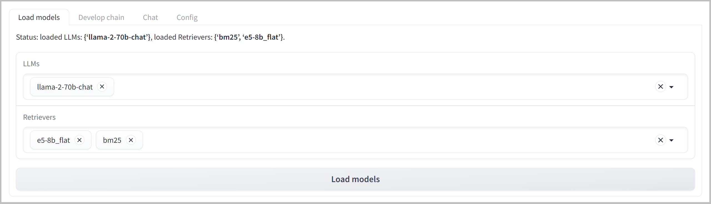
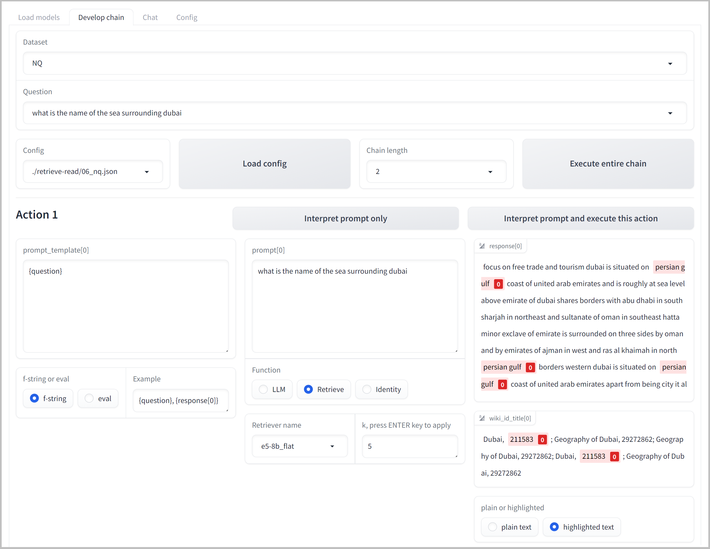
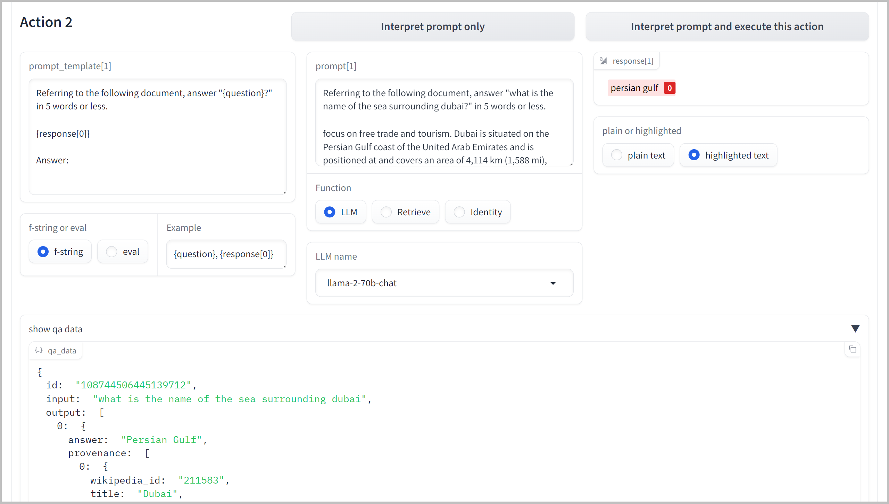
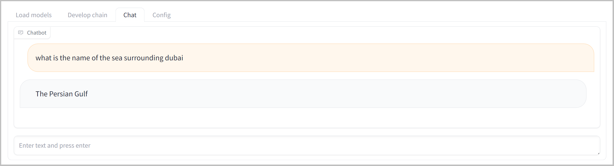
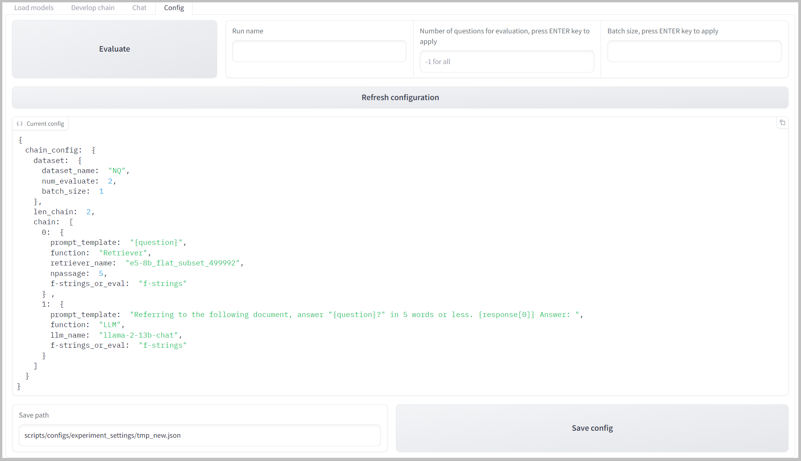

# RᴀLLᴇ Usage on GUI

Once the document indexing is completed, the retrievers (and the corresponding indices) and LLMs can be loaded via the [Gradio](https://www.gradio.app/)-based GUI to establish the inference chain that comprises the R-LLM.

An overview of the main uses of RᴀLLᴇ on GUI is presented in [this video](https://youtu.be/JYbm75qnfTg).

## Launch the development screen on your localhost

Run [scripts/chat.py](../scripts/chat.py)

```bash
python scripts/chat.py
```

## Load LLMs and Retrievers (and corresponding indices)

To load the pre-trained language models and retrievers (indices) in the `Load Models` tab, 
1. Select the LLMs and Retrievers you want to use from the list of available models (and correponding indices) written in the configuration file.
2. Click the `Load Models` button to load them.



## Chain Construction

The chain of action enables users to design pipelines for multi-step inference of R-LLMs, such as [*retrieve*]-[*generate*], or more intricate workflows such as [*rewrite query*]-[*retrieve*]-[*summarize the retrieved document*]-...-[*generate*].




To develop the inference chain in `Develop chain` tab, follow these steps:

1. Select a dataset and a question, and choose a corresponding configuration file (if available). You can also define a custom question.
2. Set the chain length (number of actions).
3. For each action in the chain, provide a prompt template using Python `f-strings` or the `eval()` function.
   - Use the `Interpret Prompt Only` button to view how the prompt template works without executing any LLMs or retrievers.
4. Specify whether you want to use `LLM`, `Retrieve` function, or `Identity` operators for each action.
   - When using the `Retrieve` function, you should specify *k*, which represents the number of top-k retrieved documents.
   - The `Identity` operator is particularly useful when you want to transform the preceding output utilizing a prompt template while preserving the original output unaltered, without employing an LLM. This can be applied to, for example, output the titles of the retrieved documents or extract a span delimited by specific tokens within questions.
5. Click the `Interpret Prompt and Execute This Action` button to execute each action individually and see the responses.
6. To execute the entire inference chain, click the `Execute Entire Chain` button.

By following these steps, you can create and execute complex inference chains involving multiple LLMs and retrievers to answer your questions.



Additional functionality on this tab:

- `Highlighted text` highlights the gold answer in the output, or gold Wikipedia ID, if exists.
- You can view the selected QA data.

**Notes:**

- The models, indexes, corpora, and datasets that can be loaded can be specified in the configuration file located in the [scripts/configs/base_settings](../scripts/configs/base_settings) directory.
- The available maximum chain length and the number of questions displayed in the `Develop chain` tab are configurable in the [scripts/configs/base_settings/system.json](../scripts/configs/base_settings/system.json).

## Simple Chat Interface

On the `Chat` tab, you can test out the developed best practices using a simple chat interface.



## Evaluate and Save config

### Evaluate the Developed Chain

You can evaluate the developed chain on a dev set of the dataset.
Specify the run name, number of questions to test (-1 for all questions), and batch size.

To evaluate, click the `Evaluate` button after specifying the run name, the number of questions to test (-1 for all questions), and the suitable batch size.

The evaluation can also be carried out using [evaluation script](../scripts/experiment.py). For detailed instructions, please refer to [this documentation](evaluation.md).

The evaluation results can be reviewed on MLflow GUI after running MLflow (see [this documentation](mlflow.md)).

### Save Config

You can save the developed chain configuration.
Click the `Refresh configuration` to update the config and save the config by clicking `Save Config` button.



